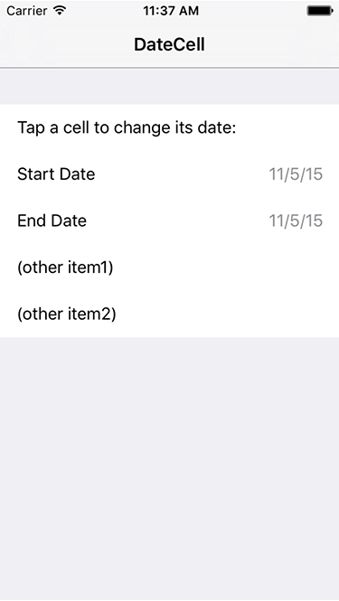

# DateCell

| Title                | Notes                                                            |
 --------------------- | ---------------------------------------------------------------- |
| Last Revision        | Version 1.0, 2015-11-05 ([Full Revision History](History.md)) |
| Build Requirements   | Xcode 7.0, iOS SDK 7.0                                           |
| Runtime Requirements | iOS 7.0 or later                                                 |

Demonstrates formatted display of date objects in table cells and use of UIDatePicker to edit those values.

Official objective-c version can be found here: https://developer.apple.com/library/ios/samplecode/DateCell/Introduction/Intro.html

